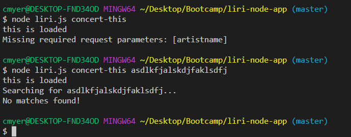
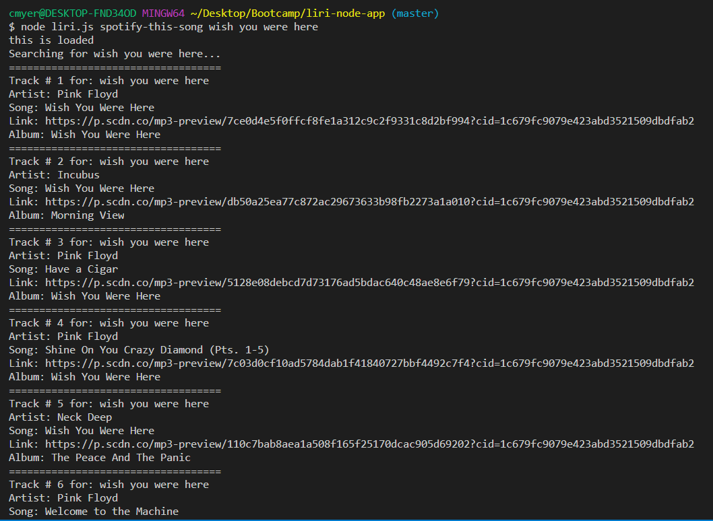
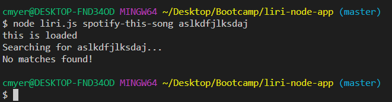
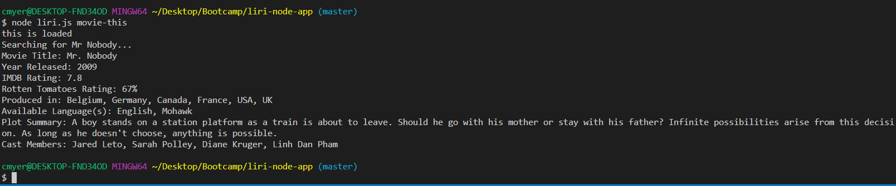
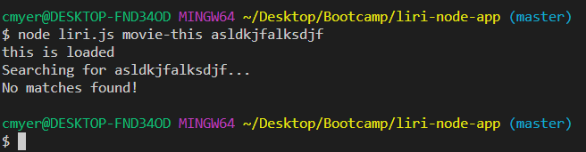

# liri-node-app

Caleb Myers

### Overview

This is a command line LIRI program designed to access data from Spotify, BandsInTown, and IMDb. This allows users to retrieve data from these three sources in one program with easy to use commands.

There are several commands available in the program that users may choose from.

 * `concert-this`
 * `spotify-this-song`
 * `movie-this`
 * `do-what-it-says`

To begin, navigate to your directory containing the program files. You will need three pieces of information to run a command:

 * The file name -- `liri.js`

 * Which command you want to run

 * A term to search for

These three items will allow you to make a command with LIRI. (NOTE: `do-what-it-says` does not require a search term after the command).

# Examples

### Making a search with BandsInTown

A request with any matches will display relevant information for all of them.

 * `node liri.js concert-this Red Hot Chili Peppers`

If a search term is not entered, or there are no matching results, an error will display in the console.

### Making a search with Spotify

A request with any matches will display relevant information for the first page of results (Default is 20 per page).

 * `node liri.js spotify-this-song Wish You Were Here`

If a search term is not entered, a search for "The Sign" by Ace of Base will be made.

If a search term is entered, but no matches are found, an error will display in the console.

### Making a search with IMDb

A request with a match will display relevant information related to the movie.

 * `node liri.js movie-this The Goonies`

If a search term is not entered, a search for "Mr. Nobody" will be made.

If a search term is entered, but no matches are found, an error will display in the console.

### Running the command listed in `random.txt`

The `do-what-it-says` command looks at the `random.txt` file and runs the command it contains.

Currently, the page contains the `spotify-this-song` command with "I Want it That Way" as a search term.

 * `node do-what-it-says`

 

# Details

This program utilizes Node.js to run outside of a browser.

In addition, several NPM packages are used: Axios, Dotenv, Node-Spotify-Api, and Moment

The `concert-this` and `movie-this` commands utilize Axios to make API requests to BandsInTown and OMDb, respectively. This information is then parsed for relevant information which is displayed in the console.

The `spotify-this-song` command utilizes the `node-spotify-api` package to make API requests to Spotify with ease. This information is then parsed for relevant information which is displayed in the console.

The `do-what-it-says` command utilizes the stock `fs` package to read `random.txt` and process the command it contains.